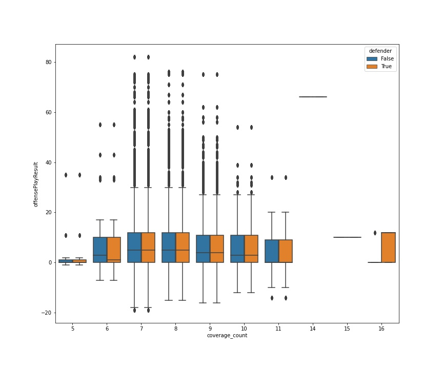

    

# Erdos Institute + NFL Big Data Bowl 2021 Prediction Model
This is a stored repository of data and Python codes for the "Sports Analytics Project" group for the 2021 Erdos Institute. Data for this project can be found here: [NFL Project Data](https://www.kaggle.com/c/nfl-big-data-bowl-2021/data). 

This project was completed as part of the The Erdős Institute Data Science Boot Camp 2021 and will be submitted to compete in the National Football League’s (NFL) 2020-21 Big Data Bowl. Clicking the images above will link to each respective website if further information is required. The NFL Big Data Bowl is an annual analytics contest that explores statistical innovations in football. NFL data from the 2018 season was analyzed to provide recommendations and summaries for optimal defensive coverages, first down analysis, and penalty analysis. To successfully create a prediction model that NFL teams can benefit from, it is important to understand football and its related data. This will allow data scientists to identify significant data for building a model.    

**Football for Non-Football Data Scientists**

Football is a sport where two opposing teams are competing over possession of the football and field position. The goal of the offense is to gain at least 10 yards every four downs (plays) to prevent turnovers and eventually score while the goal of the defense is to prevent these gains and secure turnovers. 

*Right click images below to view videos in a new tab and avoid leaving this page.*

If a more in-depth overview is required, click the image below to watch an explanatory YouTube video provided by the NFL: 

Click the image below for a YouTube video explanation of the 4-3 vs 3-4 defense provided by Law Nation: 

Click the image below for a YouTube video explanation of defensive coverage schemes provided by the NFL: 

# Goals

**1. Optimal Defensive Coverages:**

Passing plays are the most efficient way for the offensive team to gain field position. Over the course of its history, the NFL has increasingly become a passing focused league. The chart and table below show the increasing efficiency of pass plays vs run plays over the years:

Chart and table above created with data provided by: (<https://www.pro-football-reference.com/>)

NFL teams went from averaging 85 passing yards per game in the 1930s to 234 passing yards per game in 2010-2020. The increases in average passing yards occurred while average rushing yards have decreased at a stagnant rate. Because of this, it is important to find out which defensive coverages perform the best at limiting passing success. 

EPA is the difference between the Expected Points (EP) at the start of a play and the EP at the end of they play. EPA is the measure of a play’s impact on the score of the game. An individual player’s EPA is the sum of the EPA of the plays in which that player was directly involved. Being directly involved is defined as an offensive player who ran, threw, or kicked the ball, was targeted by a pass, or flagged for a penalty (<https://www.advancedfootballanalytics.com/index.php/home/stats/stats-explained/glossary>).

GOAL: 

Significant data from the 2018 NFL season will be analyzed to find out which defensive coverages result in the smallest EPA and smallest average passing yards to provide recommendations and summaries for optimal defensive coverages.

**2. First Down Analysis:**

As explained earlier, an offense has four downs or fewer to advance the 10 yards required to gain a first down, which allows them to maintain possession and earns them another four downs. The initial down in a series of downs is called a first down (<https://operations.nfl.com/learn-the-game/nfl-basics/terms-glossary/>). The goal of the offensive team is to secure first downs and eventually score, while the goal of the defensive team is to prevent first downs and to secure turnovers. Because of this, it is important to find out which offensive formations are best at securing first downs and which defensive formations are best at preventing first downs.

GOAL:

Analysis will consist of examining factors such as quarter, down, yards to go, play result, play type (pass or sack), and offensive and defensive personnel from the 2018 NFL season to find out the first down success percentage of different offensive and defensive formations. 

**3. Penalty Analysis:**

When either the offense or defense violates the rules of the game, they are assessed a penalty. The teams and fans know a penalty has been called when an official throws a yellow flag on the field (<https://operations.nfl.com/learn-the-game/nfl-basics/terms-glossary/>). Penalties award field position to either the offensive or defensive team based on which team committed the penalty. Penalties range from 5 yards, 10 yards, 15 yards, to potentially the entire length of the field when it comes to pass interference. Because of this, it is important to find out which formations are generally prone or averse to committing penalties. 

GOAL:

Analysis will consist of examining data from the 2018 NFL season to find out which offensive and defensive formations are more or less likely to commit penalties. Moreoever, we aim to predict penalties based on week 1 player tracking data as well as plays data.

# Model Building 

**Optimal Defensive Coverages and Penalties Models**: 

The preprocessing of the data for the penalties model consisted of merging the plays data set with the player tracking week 1 data set. Due to the imbalanced target variable issue, we only considered the most relevent field positions that would induce a penalty (e.g. no special teams players). Moreover, we only considered the most often implemented defensive and offensive personnel packages. Defensively, we considered the 4-2-5, 3-3-5, 4-3-4, 2-4-5, 2-3-6, 3-4-4, 3-2-6, 4-1-6 formations (nickel and dime formations)l. Offensively, this consisted of the 11, 12, 21, 13, spread, and 22 formations. This oversampling procedure balanced the target variable slighly and made the data easier to model with. The penalites model considered information for the following features: 'yardsToGo', 'defendersInTheBox', 'numberOfPassRushers', 'passResult', 'offensePlayResult', 'x', 'y', 'a', 'dis', 'o', 'dir', 'defender', 'coverage_count' with the target variable being the binary penaltyCodes column (0 for no flag on the play, '1' if there was one). 
 

**1. Logistic Regression:** uses a logistic function to model a binary dependent variable. 

More info here: <https://towardsdatascience.com/introduction-to-logistic-regression-66248243c148>. 

**2. Random Forest:** consists of a large number of individual decision trees that operate as an ensemble. Each individual tree in the random forest spits out a class prediction and the class with the most votes becomes our model’s prediction. 

More info here: <https://towardsdatascience.com/understanding-random-forest-58381e0602d2>. 

**3. Adaboost:** initially created to increase the efficiency of binary classifiers, it uses an iterative approach to learn from the mistakes of weak classifiers, and turn them into strong ones. 

More info here: <https://blog.paperspace.com/adaboost-optimizer/#:~:text=AdaBoost%20is%20an%20ensemble%20learning,turn%20them%20into%20strong%20ones>. 

And here: <https://towardsdatascience.com/understanding-adaboost-2f94f22d5bfe>. 

**4. Gradient Boosted Classifier:** each predictor tries to improve on its predecessor by reducing the errors, but instead of fitting a predictor on the data at each iteration it actually fits a new predictor to the residual errors made by the previous predictor. 

More info here: <https://towardsdatascience.com/gradient-boosting-classification-explained-through-python-60cc980eeb3d>.  

**First Down Models**: 

**1. Bagging:** machine learning process that takes several weak models and aggregates the predictions to select the best prediction. 

More info here: https://towardsdatascience.com/ensemble-methods-bagging-boosting-and-stacking-c9214a10a205. 

**2. Support Vector Machine (SVM):** The objective of the support vector machine algorithm is to find a hyperplane in an N-dimensional space(N — the number of features) that distinctly classifies the data points. 

More info here: https://towardsdatascience.com/support-vector-machine-introduction-to-machine-learning-algorithms-934a444fca47.

**3. K-Nearest Neighbors (KNN):** an algorithm that stores all the available cases and classifies the new data or case based on a similarity measure. It is mostly used to classifies a data point based on how its neighbours are classified. 

More info here: <https://towardsdatascience.com/a-simple-introduction-to-k-nearest-neighbors-algorithm-b3519ed98e>. 

## EDA
Here are some highlights of the EDA for the data. 

**General Plays/player EDA**:

Barchart of events that are contained in the data. 

Barchart detailing how many players of each position are in the data. 

**Defensive Coverage**:

When a defense has 7 defenders in coverage, that the median is significantly higher than the other coverage counts, but this could also be because the number of times 7 defenders were in coverage. 

For complete and incomplete passes, there was either 7 or 8 defenders on the play. For sacks, interestingly enough, the amount of players in pass coverage was prediominantly between 7 and 9. 

From this count plot, we can see that the 4DL, 2LB, 5DB (4-3 nickel) has the most completions against them. After that, defensive formations '3DL, 3LB, 5DB','4DL 3LB, 4DB', and '2DL, 4LB, 5DB',  had the most completions. 

Box plot relating the information from the defensive coverages to the offensive output along with coverage counts. It looks like the mainly used coverage counts were 7,8,9, 10 with the most positive use. Let's take that into consideration.

Box plot analyzing the most used defensive coverages along with the number of pass rushers to see how that affects offensive output. As we can see here, having 7 pass rushers seems to be detrimental to most defenses. It looks like rushing 4 or 5 may be optimal.

**Penalties**: 

Most penalties were called when there were 10 players in coverage. When there were 7 in coverage, it was almost negligible

Certainly more penalties thrown on incomplete passes, which is what one would expect. 

This shows us what we thought would be true: the position on the field of the player does have an impact whether a flag will be called or not.

# Model Results and Performance 
**Optimal Defensive Coverages:** 

4-2-5, 3-3-5, and 2-4-5 base defenses had the best success against the pass based on data with EPA= .70 and the average completed yards= 10.7. The base 3-4-4 and 4-3-4 defensive formations preformed the worst against the pass with highest average completed yards against= 2.70.    

**First Down Model**: 

The model was able to predict whether an offensive formation would convert a first down against a defensive formation. **Bagging SVC was the best model with accuracy= 66.36%.** Accuracies of all tested models below:
* **Bagging SVC=** 66.36%
* **Pasting SVC=** 66.21%
* **Voting=** 66.16%
* **Decision Tree=** 66.11%
* **Random Forest=** 66.11%
* **Pasting RF=** 66.03%
* **Linear SVC=** 66.02%
* **Bagging RF=** 66.01%
* **Logistic Regression=** 65.51%
* **KNN=** 65.39%
* **SVC (signmoid kernel)=** 63.04%
* **K-means=** 46.52%

**Penalties Model**: 

4-2-5, 3-3-5, and 2-4-5 base defenses had the best success against the pass based on data with EPA= .70 and the average completed yards= 10.7. The base 3-4-4 and 4-3-4 defensive formations preformed the worst against the pass with highest average completed yards against= 2.70.  
 

The gradient boosted classifier outperformed other models in terms of recall score. 
* **Logistic Regression**: Recall=0.71 with cutoff at 0.1
* **Random Forest**: Recall=0.75
* **Ada Boost**: Recall=0.00
* **Gradient Boosted Classifier**: Recall=0.78 

Recall was the metric of choice due to the imbalanced target variable. We wanted to make sure that the model captured 
enough of the flagged target data. 
